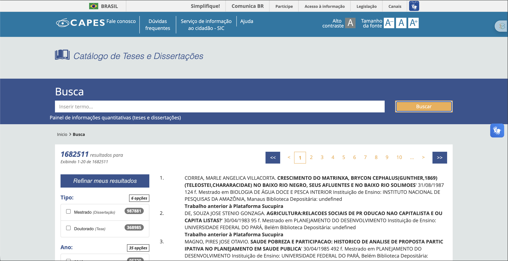
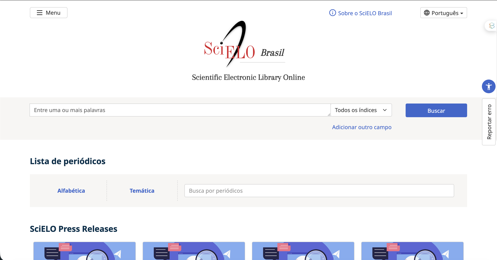
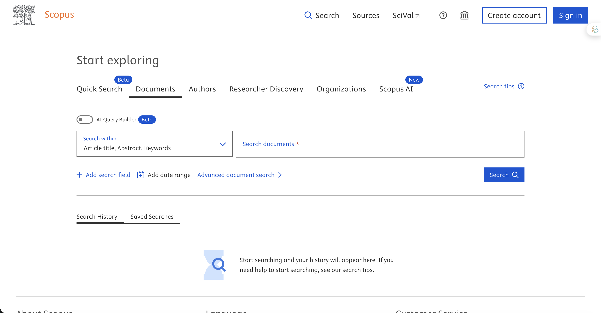
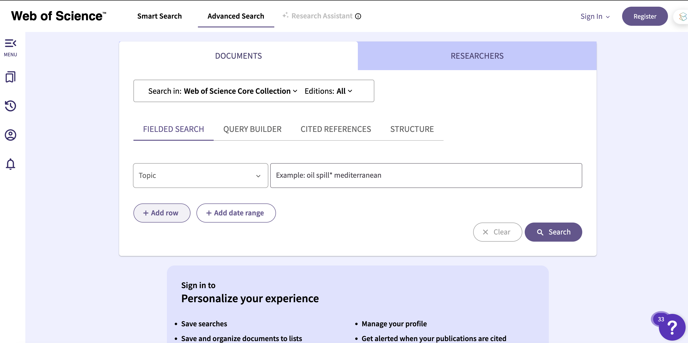
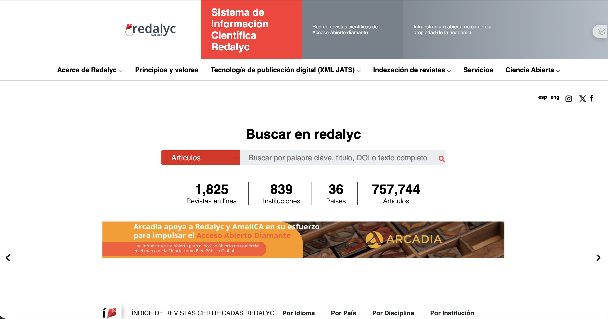
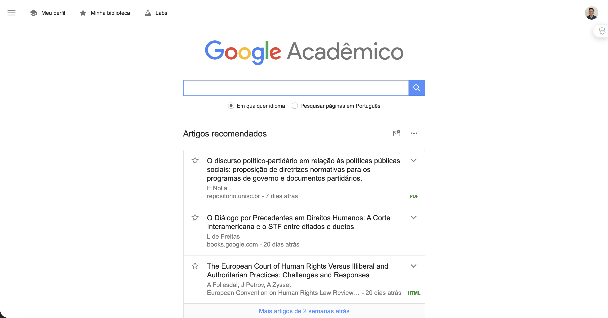

## Por que dominar bases acadêmicas?

-   Revisão de literatura
-   Identificação do estado da arte
-   Medir impacto científico
-   Mapear lacunas de pesquisa
-   Formular perguntas originais 🤔

------------------------------------------------------------------------

## Bases × Indexadores × Repositórios

::::: columns
::: {.column width="50%"}
**Base de dados**

-   Conteúdo selecionado
-   Metadados estruturados
-   Ferramentas analíticas
-   Ex: SciELO, Scopus, Web of Science

**Repositório**

-   Armazena trabalhos
-   Foco em acesso aberto
-   Ex: Portal de Teses e Dissertações CAPES
:::

::: {.column width="50%"}
**Indexador**

-   Rastreamento amplo
-   Qualidade variável
-   Ex: Google Acadêmico
:::
:::::

------------------------------------------------------------------------

## Portal de Teses e Dissertações da CAPES

::: {style="text-align: center; margin-top: 2%;"}
{width="80%" fig-align="center"}
:::

------------------------------------------------------------------------

## Portal de Teses e Dissertações da CAPES

::::: columns
::: {.column width="50%"}
**Características**

-   Repositório nacional de teses e dissertações
-   Programas reconhecidos pela CAPES
-   Cobertura desde 1987
-   +1,3 milhão de trabalhos (estimativa)
-   Acesso gratuito
:::

::: {.column width="50%"}
**Utilidade**

-   Mapear produção científica
-   Identificar temas emergentes
-   Analisar distribuição por IES
-   Estudos bibliométricos
-   Base ideal para teses e dissertações brasileiras
:::
:::::

------------------------------------------------------------------------

## SciELO (Scientific Electronic Library Online)

::: {style="text-align: center; margin-top: 2%;"}
{width="80%" fig-align="center"}
:::

------------------------------------------------------------------------

## SciELO (Scientific Electronic Library Online)

::::: columns
::: {.column width="50%"}
**Características**

-   Rede de periódicos científicos
-   Forte presença latino-americana
-   Acesso aberto
-   \+ de 1.300 periódicos ativos
-   16 países participantes
:::

::: {.column width="50%"}
**Utilidade**

-   Artigos em português e espanhol
-   Principais revistas jurídicas brasileiras
-   Exportação de citações
-   Métricas de acesso
-   API para coleta de dados
:::
:::::

------------------------------------------------------------------------

## Scopus (Elsevier)

::: {style="text-align: center; margin-top: 2%;"}
{width="80%" fig-align="center"}
:::

------------------------------------------------------------------------

## Scopus (Elsevier)

::::: columns
::: {.column width="50%"}
**Características**

-   Base multidisciplinar
-   Uma das maiores do mundo
-   +28 mil periódicos
-   \~92 milhões de registros
-   Acesso institucional
:::

::: {.column width="50%"}
**Utilidade**

-   Busca avançada internacional
-   Métricas científicas
-   h-index e CiteScore
-   Redes de colaboração
-   Exportação de dados
:::
:::::

------------------------------------------------------------------------

## Web of Science (Clarivate)

::: {style="text-align: center; margin-top: 2%;"}
{width="80%" fig-align="center"}
:::

------------------------------------------------------------------------

## Web of Science (Clarivate)

::::: columns
::: {.column width="50%"}
**Características**

-   Base histórica da ciência
-   Critérios rigorosos de seleção
-   Menor cobertura que Scopus
-   Métrica principal: JIF
-   Referência para avaliação científica
:::

::: {.column width="50%"}
**Utilidade**

-   Análise de citações
-   Impacto de periódicos
-   Journal Citation Reports
-   Genealogia de citações
-   Avaliação institucional
:::
:::::

------------------------------------------------------------------------

## Redalyc (Rede ibero-americana de periódicos)

::: {style="text-align: center; margin-top: 2%;"}
{width="80%" fig-align="center"}
:::

------------------------------------------------------------------------

## Redalyc (Rede ibero-americana de periódicos)

::::: columns
::: {.column width="50%"}
**Características**

-   Repositório científico aberto
-   Foco em América Latina
-   Publicação sem APC
-   +1.580 revistas
-   Acesso gratuito
:::

::: {.column width="50%"}
**Utilidade**

-   Literatura latino-americana
-   Artigos completos em PDF
-   Dados abertos
-   Complemento ao SciELO
:::
:::::

------------------------------------------------------------------------

## Google Acadêmico

::: {style="text-align: center; margin-top: 2%;"}
{width="80%" fig-align="center"}
:::

------------------------------------------------------------------------

## Google Acadêmico

::::: columns
::: {.column width="50%"}
**Usos comuns**

-   Busca rápida por artigos
-   Encontrar versões preprint
-   Localizar citações
-   Perfis de pesquisadores
-   Teses e anais
:::

::: {.column width="50%"}
**Limitações relevantes**

-   Não é base estruturada
-   Metadados inconsistentes
-   Fontes sem revisão por pares
-   Citações duplicadas
-   Usar apenas para descoberta
:::
:::::

::: {style="font-size: 0.55em; color: #5f6b76; text-align: center; margin-top: 1em;"}
*"Google Acadêmico não é base de dados. É uma caixa de sugestões."*
:::

------------------------------------------------------------------------

## Comparativo

| Base             | Tipo           | Acesso        | Melhor uso          |
|------------------|----------------|---------------|---------------------|
| CAPES            | Repositório    | Gratuito      | Teses brasileiras   |
| SciELO           | Base aberta    | Gratuito      | Artigos LATAM       |
| Scopus           | Base comercial | Institucional | Bibliometria        |
| WoS              | Base comercial | Institucional | Impacto científico  |
| Redalyc          | Base aberta    | Gratuito      | Produção 31 países. |
| Google Acadêmico | Indexador      | Gratuito      | Busca inicial 🙏    |

------------------------------------------------------------------------

## Estratégia de busca possível

**Pesquisa jurídica brasileira**

CAPES → SciELO → Scopus

**Análise bibliométrica**

Scopus ou Web of Science

**Literatura latino-americana**

SciELO + Redalyc

**Busca rápida**

Google Acadêmico

::: {style="font-size: 0.55em; color: #5f6b76; margin-top: 1.5em;"}
⚠️ Iniciar pelo Google Acadêmico e parar por aí não é estratégia. É esperança.
:::

------------------------------------------------------------------------

## Recursos

::::: columns
::: {.column width="50%"}
**Portais**

-   [catalogodeteses.capes.gov.br](https://catalogodeteses.capes.gov.br)
-   [scielo.br](https://www.scielo.br/)
-   [scopus.com](https://www.scopus.com/pages/home#basic)
-   [webofscience.com](https://clarivate.com/academia-government/scientific-and-academic-research/research-discovery-and-referencing/web-of-science/)
-   [redalyc.org](https://www.redalyc.org/)
-   [scholar.google.com](https://scholar.google.com/)
:::

::: {.column width="50%"}
**Pacotes**

-   [`capesR`](https://cran.r-project.org/web/packages/capesR/index.html)
-   [`rscopus`](https://cran.r-project.org/web/packages/rscopus/index.html)
-   [`easyScieloPack`](https://cran.r-project.org/web/packages/easyScieloPack/index.html)
:::
:::::

------------------------------------------------------------------------

## Hora de botar a mão na massa!!!

::: {style="text-align: center; margin-top: 0%;"}
{width="80%"}
:::
